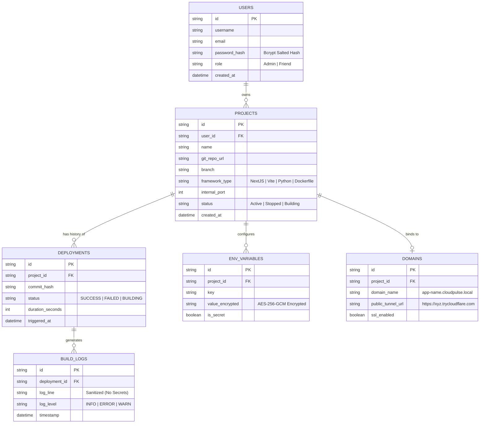
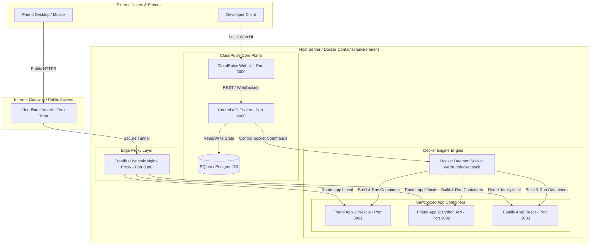
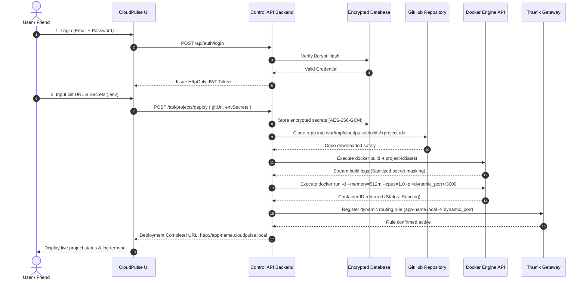

# 📊 Project Definition Report (PDR) & System Architecture

## 📋 1. Executive Summary & Project Definition

**Project Name:** CloudPulse  
**Target Platform:** Self-Hosted Linux / Docker Infrastructure  
**Primary Purpose:** A 100% free, private Platform-as-a-Service (PaaS) allowing developers, friends, and family to deploy, host, and manage web applications and services without relying on paid cloud providers.

### **Functional Requirements:**
- **User & Auth Management:** Multi-user support with role-based access control (Admin vs Friend roles).
- **Git Integration:** Auto-clone and auto-build from public or private GitHub/GitLab repositories.
- **Container Lifecycle Management:** Trigger `build`, `start`, `stop`, `restart`, and `delete` operations on deployed app containers via Docker API.
- **Dynamic Subdomain Routing:** Automatic proxying of incoming requests to target container ports based on subdomain headers.
- **Log Streaming:** Real-time stdout/stderr build and execution log streaming to UI via WebSockets.
- **Public Tunneling:** One-click integration with Cloudflare Tunnels for zero-trust public HTTPS deployment.

---

## 🗄️ 2. Entity-Relationship (ER) Diagram

The system database schema manages users, projects, builds, environment secrets, and domain configurations.

---

## 🏗️ 3. High-Level System Architecture Diagram

---

## 🔄 4. Data Flow & End-to-End Sequence Diagram

This sequence details the step-by-step lifecycle from authentication to dynamic deployment:

---

## 🛡️ 5. Data Safety & Security Matrix

| Layer | Security Threat | Mitigation Mechanism | Implementation Details |
| :--- | :--- | :--- | :--- |
| **Authentication** | Brute force / Credential theft | Bcrypt + JWT Cookies | 12 Salt Rounds, HttpOnly, SameSite=Strict cookies |
| **Database Secrets** | Plaintext leaks / DB dumping | AES-256-GCM Encryption | Secrets encrypted at rest; decrypted in-memory only at container startup |
| **Git Ingestion** | Remote Code / Shell Injection | Strict Input Sanitization | Validates HTTPS git URLs, rejects arbitrary shell tokens |
| **Container Engine** | Host takeover / Resource exhaustion | Unprivileged Cgroups | CPU ceiling (`1.0`), RAM max (`512MB`), isolated network bridges |
| **Log Terminal** | Accidental API Key disclosure | Regex Secret Masking | Automatically redacts matching `.env` secret values before outputting logs |
| **Public Gateway** | Port scanning / DDoS | Cloudflare Tunnels | Outbound-only TLS connection; no open inbound router ports required |

