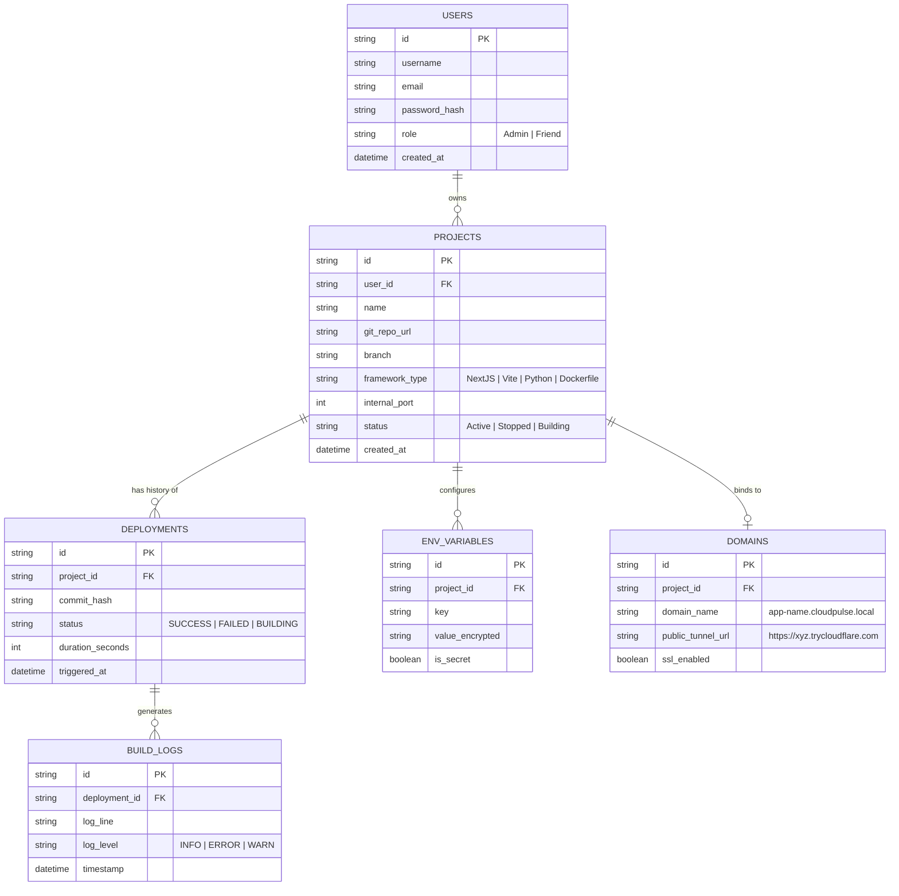
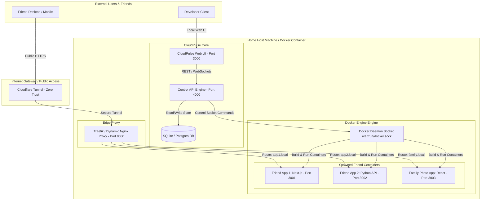
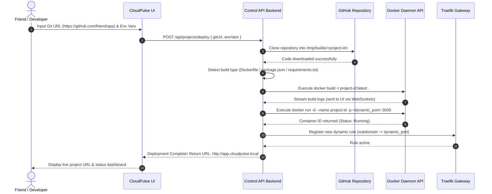

# 📊 Project Definition Report (PDR) & System Architecture

## 📋 1. Executive Summary & Project Definition

**Project Name:** CloudPulse  
**Target Platform:** Self-Hosted Linux / Docker Infrastructure  
**Primary Purpose:** A 100% free, private Platform-as-a-Service (PaaS) allowing developers, friends, and family to deploy, host, and manage web applications and services without relying on paid cloud providers.

### **Functional Requirements:**
- **User & Auth Management:** Multi-user support with role-based access (Admin, Developer/Friend).
- **Git Integration:** Auto-clone and auto-build from public or private GitHub/GitLab repositories.
- **Container Lifecycle Management:** Trigger `build`, `start`, `stop`, `restart`, and `delete` operations on deployed app containers via Docker API.
- **Dynamic Subdomain Routing:** Automatic proxying of incoming requests to target container ports based on subdomain headers.
- **Log Streaming:** Real-time stdout/stderr build and execution log streaming to UI.
- **Public Tunneling:** One-click integration with Cloudflare Tunnels for zero-trust public HTTPS deployment.

---

## 🗄️ 2. Entity-Relationship (ER) Diagram

The system database schema manages users, projects, builds, environment secrets, and domain configurations.

---

## 🏗️ 3. High-Level System Architecture Diagram

---

## 🔄 4. Data Flow & Deployment Sequence Diagram

This sequence illustrates what happens when a friend deploys a new project from a Git repository URL:

---

## 🛡️ 5. Security & Resource Isolation Blueprint

1. **Docker Container Isolation:**
   - Every deployed project runs in its own non-privileged container bridge network.
   - Deployed containers cannot access host files or other containers unless explicitly linked.
2. **Resource Limits per Project:**
   - **RAM Limit:** Default `512MB` max per container (prevents one memory-heavy app from freezing your server).
   - **CPU Limit:** Default `1.0 CPU Core` ceiling.
3. **Secret Encryption:**
   - All environment variables (`.env`) stored in the database are encrypted at rest using AES-256 GCM encryption.
